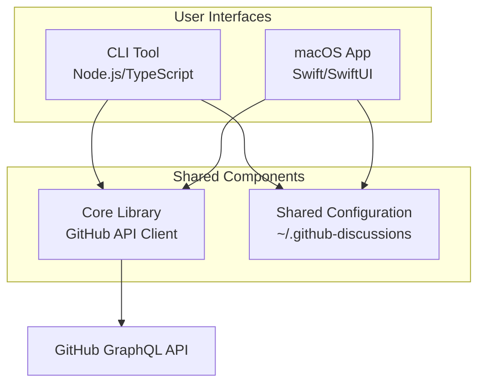
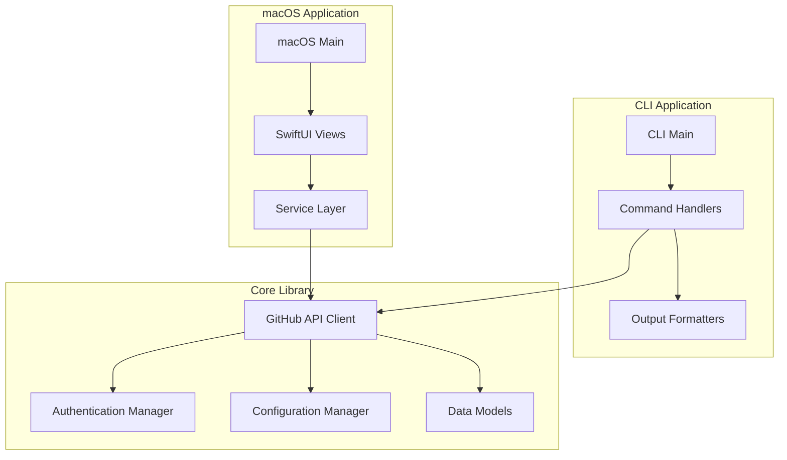

# Design Document

## Overview

GitHub Discussions CLIツールとmacOSアプリケーションは、開発者がブラウザを開かずにGitHub Discussionsと効率的にやり取りできるようにするツールです。CLIツールはクロスプラットフォーム対応のNode.js/TypeScriptで実装し、macOSアプリはSwift/SwiftUIでネイティブ体験を提供します。両方のインターフェースは共通のコア機能を共有し、GitHub GraphQL APIを使用してDiscussionsにアクセスします。

## Architecture

### High-Level Architecture



### Component Architecture



## Components and Interfaces

### 1. Core Library (Node.js/TypeScript)

#### GitHub API Client
```typescript
interface GitHubDiscussionsClient {
  listDiscussions(repo: string, options?: ListOptions): Promise<Discussion[]>
  getDiscussion(repo: string, discussionId: string): Promise<DiscussionDetail>
  createComment(repo: string, discussionId: string, body: string): Promise<Comment>
  createDiscussion(repo: string, title: string, body: string, categoryId?: string): Promise<Discussion>
}

interface Discussion {
  id: string
  title: string
  author: string
  createdAt: Date
  commentCount: number
  category?: string
  url: string
}

interface DiscussionDetail extends Discussion {
  body: string
  comments: Comment[]
}

interface Comment {
  id: string
  author: string
  body: string
  createdAt: Date
  url: string
}
```

#### Authentication Manager
```typescript
interface AuthManager {
  getToken(): Promise<string | null>
  setToken(token: string): Promise<void>
  validateToken(token: string): Promise<boolean>
  clearToken(): Promise<void>
}
```

#### Configuration Manager
```typescript
interface ConfigManager {
  getDefaultRepo(): Promise<string | null>
  setDefaultRepo(repo: string): Promise<void>
  getConfig(): Promise<Config>
  updateConfig(config: Partial<Config>): Promise<void>
}

interface Config {
  defaultRepo?: string
  token?: string
  outputFormat?: 'table' | 'json' | 'markdown'
}
```

### 2. CLI Application (Node.js/TypeScript)

#### Command Structure
- `gh-discussions list [repo]` - ディスカッション一覧表示
- `gh-discussions show <discussion-id> [repo]` - ディスカッション詳細表示
- `gh-discussions comment <discussion-id> <message> [repo]` - コメント投稿
- `gh-discussions create <title> <body> [repo] [--category]` - ディスカッション作成
- `gh-discussions config` - 設定管理

#### CLI Interface
```typescript
interface CLICommand {
  name: string
  description: string
  options: CLIOption[]
  handler: (args: any) => Promise<void>
}

interface CLIOption {
  name: string
  alias?: string
  description: string
  required?: boolean
  type: 'string' | 'boolean' | 'number'
}
```

### 3. macOS Application (Swift/SwiftUI)

#### Main Views
```swift
struct ContentView: View {
    @StateObject private var discussionsStore = DiscussionsStore()
    
    var body: some View {
        NavigationSplitView {
            DiscussionListView()
        } detail: {
            DiscussionDetailView()
        }
    }
}

struct DiscussionListView: View {
    // ディスカッション一覧表示
}

struct DiscussionDetailView: View {
    // ディスカッション詳細とコメント投稿
}

struct SettingsView: View {
    // 設定画面（トークン、デフォルトリポジトリ等）
}
```

#### Service Layer
```swift
class GitHubService: ObservableObject {
    func listDiscussions(repo: String) async throws -> [Discussion]
    func getDiscussion(repo: String, id: String) async throws -> DiscussionDetail
    func createComment(repo: String, discussionId: String, body: String) async throws -> Comment
    func createDiscussion(repo: String, title: String, body: String, categoryId: String?) async throws -> Discussion
}

class ConfigurationService: ObservableObject {
    @Published var defaultRepo: String?
    @Published var token: String?
    
    func loadConfiguration()
    func saveConfiguration()
}
```

## Data Models

### Shared Data Models
両方のアプリケーションで使用される共通のデータ構造：

```typescript
// TypeScript版
interface Discussion {
  id: string
  title: string
  author: {
    login: string
    avatarUrl?: string
  }
  createdAt: Date
  updatedAt: Date
  commentCount: number
  category?: {
    id: string
    name: string
  }
  url: string
  locked: boolean
}
```

```swift
// Swift版
struct Discussion: Codable, Identifiable {
    let id: String
    let title: String
    let author: Author
    let createdAt: Date
    let updatedAt: Date
    let commentCount: Int
    let category: Category?
    let url: String
    let locked: Bool
}

struct Author: Codable {
    let login: String
    let avatarUrl: String?
}
```

## Error Handling

### Error Types
```typescript
enum ErrorType {
  AUTHENTICATION_ERROR = 'AUTHENTICATION_ERROR',
  NETWORK_ERROR = 'NETWORK_ERROR',
  API_ERROR = 'API_ERROR',
  CONFIGURATION_ERROR = 'CONFIGURATION_ERROR',
  VALIDATION_ERROR = 'VALIDATION_ERROR'
}

interface AppError {
  type: ErrorType
  message: string
  details?: any
  suggestions?: string[]
}
```

### Error Handling Strategy
1. **CLI**: 構造化されたエラーメッセージとexit codes
2. **macOS App**: ユーザーフレンドリーなアラートとリカバリオプション
3. **共通**: ログ記録とエラー報告機能

## Testing Strategy

### Unit Testing
- **Core Library**: Jest/TypeScriptでAPI client、認証、設定管理をテスト
- **CLI**: コマンドハンドラーとアウトプットフォーマッターをテスト
- **macOS App**: XCTestでサービス層とビューモデルをテスト

### Integration Testing
- GitHub API との実際の通信テスト（テスト用リポジトリ使用）
- CLI と macOS App の設定共有テスト
- 認証フローのエンドツーエンドテスト

### E2E Testing
- CLI: 実際のコマンド実行とアウトプット検証
- macOS App: UI テストでユーザーフローを検証

### Test Data Management
- モックGitHub APIレスポンス
- テスト用設定ファイル
- サンプルディスカッションデータ

## Security Considerations

### Token Management
- Personal Access Tokenの安全な保存（macOS Keychain、暗号化設定ファイル）
- トークンの最小権限原則（discussions:read, discussions:write）
- トークン有効性の定期チェック

### API Security
- レート制限の適切な処理
- HTTPS通信の強制
- 入力値の検証とサニタイゼーション

## Performance Considerations

### Caching Strategy
- ディスカッション一覧の短期キャッシュ
- ユーザー情報のキャッシュ
- 設定情報のメモリキャッシュ

### API Optimization
- GraphQL クエリの最適化
- バッチリクエストの活用
- ページネーション対応

## Deployment and Distribution

### CLI Tool
- npm パッケージとして配布
- バイナリ配布（pkg使用）
- Homebrew formula

### macOS App
- Mac App Store配布
- 直接配布（公証済み）
- 自動更新機能